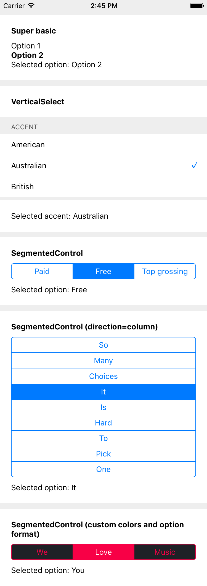
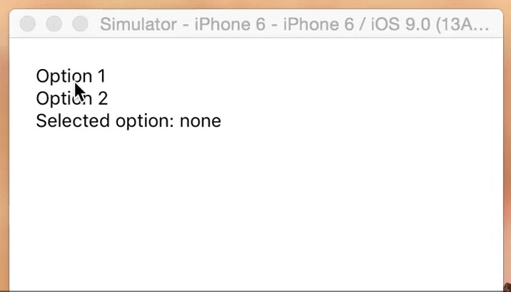

# react-native-radio-buttons

A react component to implement _radio buttons_-like behaviors: multiple options, only one option can be selected at a given time.

Both the container and option nodes are customizable. Comes with SegmentedControls clone, only more customizable (see below, animations to come).



## Install

```sh
npm i -S react-native-radio-buttons
```

## Demo app

```sh
git clone git@github.com:ArnaudRinquin/react-native-radio-buttons.git
cd react-native-radio-buttons
npm run demo
```

## Usage

Here is an extensive overview of the component usage.

```jsx
import { RadioButtons } from 'react-native-radio-buttons'

// ...

render() {
  const options = [
    "Option 1",
    "Option 2"
  ];

  function setSelectedOption(selectedOption){
    this.setState({
      selectedOption
    });
  }

  function renderOption(option, selected, onSelect, index){
    const style = selected ? { fontWeight: 'bold'} : {};

    return (
      <TouchableWithoutFeedback onPress={onSelect} key={index}>
        <Text style={style}>{option}</Text>
      </TouchableWithoutFeedback>
    );
  }

  function renderContainer(optionNodes){
    return <View>{optionNodes}</View>;
  }

  return (
    <View style={{margin: 20}}>
      <RadioButtons
        options={ options }
        onSelection={ setSelectedOption.bind(this) }
        selectedOption={this.state.selectedOption }
        renderOption={ renderOption }
        renderContainer={ renderContainer }
      />
      <Text>Selected option: {this.state.selectedOption || 'none'}</Text>
    </View>);
}

```

Will render this



## Props

* `options - []` mandatory array of anything, will be passed to `renderOption`
* `onSelection - function(selectedOption, selectedIndex){}` option selection callback
* `selectedIndex - index` the  initially selected index, optional.
* `selectedOption - option` the initially selected option, optional
* `renderOption - function(option, selected, onSelect, index)` should return an option node, default generate `<Text>` nodes and adds `{fontWeight:'bold'}` to the selected option.
* `renderContainer - function(optionsNodes)` must render the container, default is RadioButtons.renderVerticalContainer (see below)
* `optionStyle` - optional styles to be applied to the `<Text>` elements of the options themselves.
* `optionContainerStyle` - optional styles to be applied to the the `<View>` that contain the options.
* `testOptionEqual- function(selectedOption, currentOption){}` optional compares and returns bool.

### Full JavaScript SegmentedControls clone

This library comes with a clone of the native `SegmentedControls`, based on `RadioButtons`.

```jsx
import { SegmentedControls } from 'react-native-radio-buttons'

// ...

<SegmentedControls
  options={ options }
  onSelection={ setSelectedOption.bind(this) }
  selectedOption={ this.state.selectedOption }
/>
```

You override all the defaults through the props.

```jsx
<SegmentedControls
  tint={'#f80046'}
  selectedTint= {'white'}
  backTint= {'#1e2126'}
  options={ options }
  allowFontScaling={ false } // default: true
  onSelection={ setSelectedOption.bind(this) }
  selectedOption={ this.state.selectedOption }
  optionStyle={{fontFamily: 'AvenirNext-Medium'}}
  optionContainerStyle={{flex: 1}}
/>
```

Here is the list of the props you might override:

```jsx
const IOS_BLUE = '#007AFF';
const IOS_WHITE = '#ffffff';

const DEFAULTS = {
  direction: 'row',

  tint: IOS_BLUE,
  backTint: IOS_WHITE,

  paddingTop: 5,
  paddingBottom: 5,
  textAlign: 'center',

  selectedTint: IOS_WHITE,
  selectedBackgroundColor: IOS_WHITE,

  separatorTint: IOS_BLUE,
  separatorWidth: 1,

  containerBorderTint: IOS_BLUE,
  containerBorderWidth: 1,
  containerBorderRadius: 5,

}
```

You can also specify `containerStyle`, `optionContainerStyle`, and `optionStyle` to use any style you want:

* `containerStyle` - optional styles to be applied to the outermost `<View>` component.
* `optionStyle` - optional styles to be applied to the `<Text>` elements of the options themselves.
* `optionContainerStyle` - optional styles to be applied to the the `<View>` that contain the options.

You can also specify how to extract the labels from the options through the extractText prop.

```jsx
options = [
  {
    label: 'Option 1',
    value: 'opt1'
  },
  {
    label: 'Option 2',
    value: 'opt2'
  }
]

<SegmentedControls
  options={ options }
  onSelection={ setSelectedOption.bind(this) }
  selectedOption={ this.state.selectedOption },
  extractText={ (option) => option.label }
/>
```

If you decide to declare `options` as an array of objects, do also include a `testOptionEqual` prop for customized equality checking, otherwise changing `selectedOption` programmatically would not update the UI correctly. 

With the above `options`, you'll need `testOptionEqual` to be as follows in order for `selectedOption` to display correctly.

```jsx
  <SegmentedControls
    options={ options }
    onSelection={ setSelectedOption.bind(this) }
    selectedOption={ this.state.selectedOption }
    extractText={ (option) => option.label }
    testOptionEqual={(selectedValue, option) => selectedValue === option.value}
  />
```

Moreover, you can even specify the whole `renderOption()` function:

```jsx
<SegmentedControls
  // ...
  renderOption={(option, selected) => {
    return (
      // ...render stuff
    )
  }}
}}
```

## Helpers
**RadioButtons.renderVerticalContainer;**

A super simple `renderContainer` function that generates a <View> with `{flexDirection: "column"}`. It is used as default `renderContainer` if you don't specify it.

Usage:

```jsx
<RadioButtons
  options={ options }
  onSelection={ setSelectedOption }
  renderContainer={RadioButtons.renderVerticalContainer}
/>
```

**RadioButtons.renderHorizontalContainer;**

Another super simple `renderContainer` function that generates a <View> with `{flexDirection: "row"}`

Usage:

```jsx
<RadioButtons
  options={ options }
  onSelection={ setSelectedOption }
  renderContainer={RadioButtons.renderHorizontalContainer}
/>
```

**RadioButtons.getViewContainerRenderer(viewContainerStyle);**

An helper that generates a simple `<View>` with the provided style.

Usage:

```jsx
<RadioButtons
  options={ options }
  onSelection={ setSelectedOption }
  renderContainer={RadioButtons.getViewContainerRenderer({
    backgroundColor: '#f80046',
    flexDirection: 'row',
    justifyContent: 'space-around',
  })}
/>
```

**RadioButtons.getTextOptionRenderer(normalStyle, selectedStyle, extractText);**

An helper that generates `<Text>` options wrapped in `<TouchableWithoutFeedback>`.
`normalStyle` and `selectedStyle` will be applied to the <Text> nodes, depending on state. `extractText(options)` can be specified.


Usage:

```jsx
const normalStyle = {
  color: 'white'
};

const selectedStyle = {
  color: '#f80046',
  fontWeight: 'bold'
};

const extractText = (option) => option.label;

<RadioButtons
  options={ options }
  onSelection={ setSelectedOption }
  renderOptions={RadioButtons.getTextOptionRenderer(normalStyle, selectedStyle, extractText)}
/>
```
